# Anticiper les besoins en consommation électrique des bâtiments

## 📋 Description du projet

Ce projet vise à répondre à l'objectif de la ville de Seattle : **atteindre la neutralité carbone d'ici 2050**. Pour cela, il est nécessaire d'anticiper les besoins en consommation énergétique des bâtiments ainsi que leurs émissions de CO2, à partir de données récoltées en 2015 et 2016. 

### Objectifs principaux :
- **Prédire** la consommation totale d'énergie des bâtiments.
- **Prédire** les émissions de CO2.
- **Évaluer** l'intérêt de la variable *EnergyStarScore* dans la prédiction des émissions.

---

## 📊 Données utilisées

- Deux jeux de données (2015 et 2016), comprenant :
  - Informations sur les bâtiments : localisation, type d'usage, caractéristiques physiques.
  - Consommation énergétique.
  - Émissions de gaz à effet de serre (GES).

### Préparation des données
- Suppression des doublons et variables inutiles.
- Traitement des valeurs manquantes et aberrantes.
- Création de nouvelles variables (*feature engineering*).
- Transformation des variables cibles pour réduire la skewness (logarithmique).

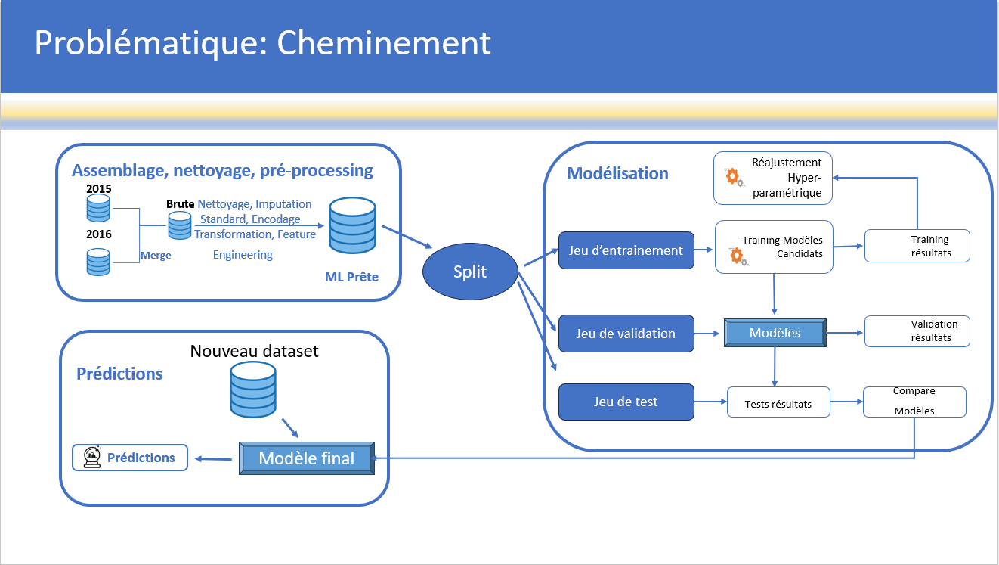

---

## 🔍 Modélisation

### Modèles explorés
- Régressions linéaires.
- Modèles d'ensemble :
  - Random Forest
  - Gradient Boosting Regressor
  - Extreme Gradient Boosting (XGBoost).

### Processus de sélection
- Séparation des données :
  - 80% pour l'entraînement.
  - 20% pour le test.
- Validation croisée (k-fold).
- Optimisation des hyperparamètres :
  - *RandomizedSearchCV*
  - *GridSearchCV*

### Résultats
- **Modèle final : Gradient Boosting Regressor**
  - Prédiction de la consommation énergétique :
    - R² : 0,91
    - RMSE : 0,872
  - Prédiction des émissions de CO2 :
    - R² : 0,91
    - RMSE : 0,408

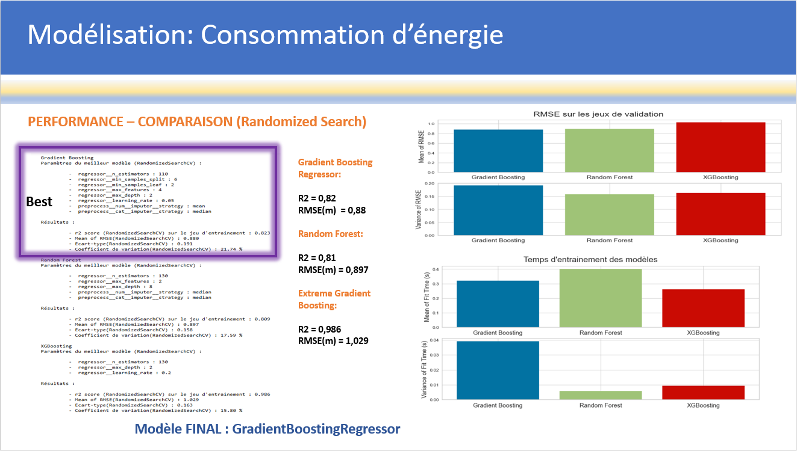
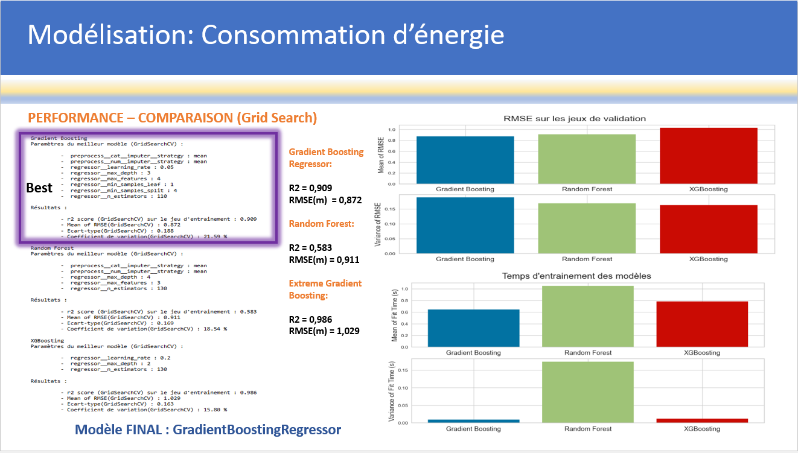
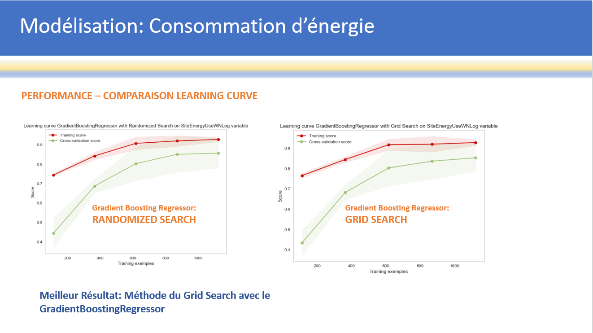
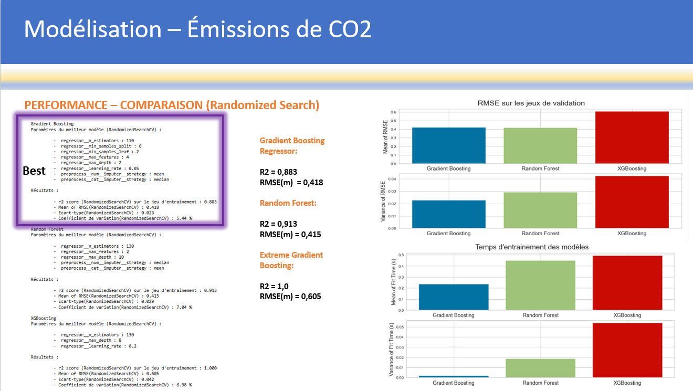
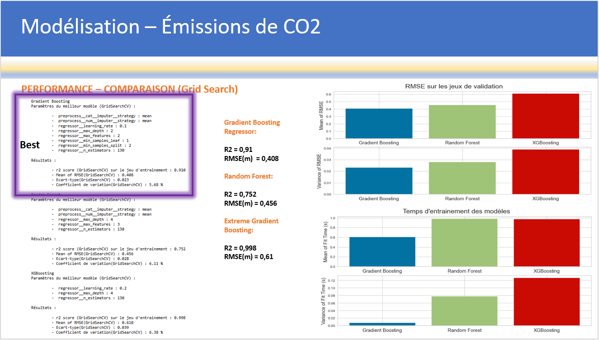
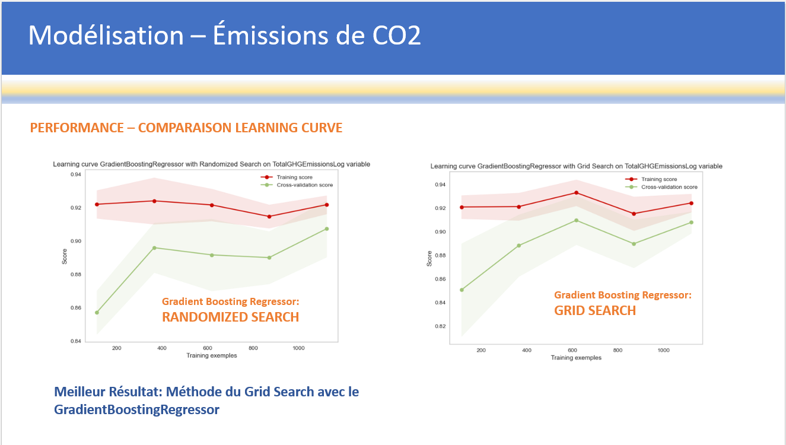

### Analyse de l'EnergyStarScore

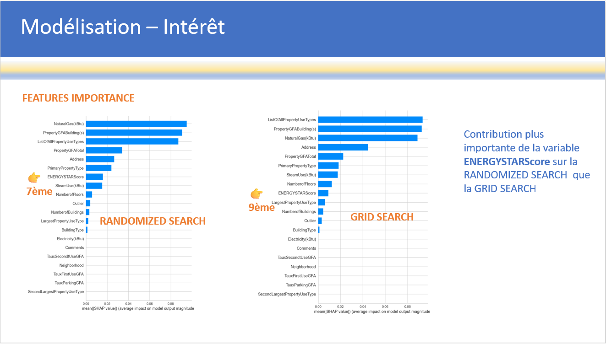

- L'inclusion de la variable *EnergyStarScore* n'améliore pas significativement les performances prédictives, mais elle peut être utilisée selon les besoins métiers.

---

## 📈 Résultats et visualisations

### Importance des caractéristiques
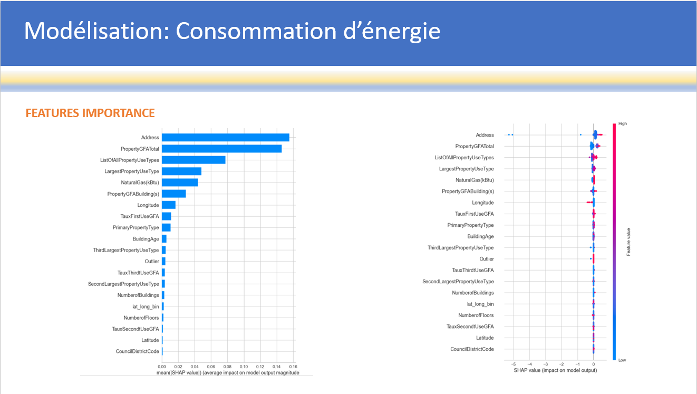
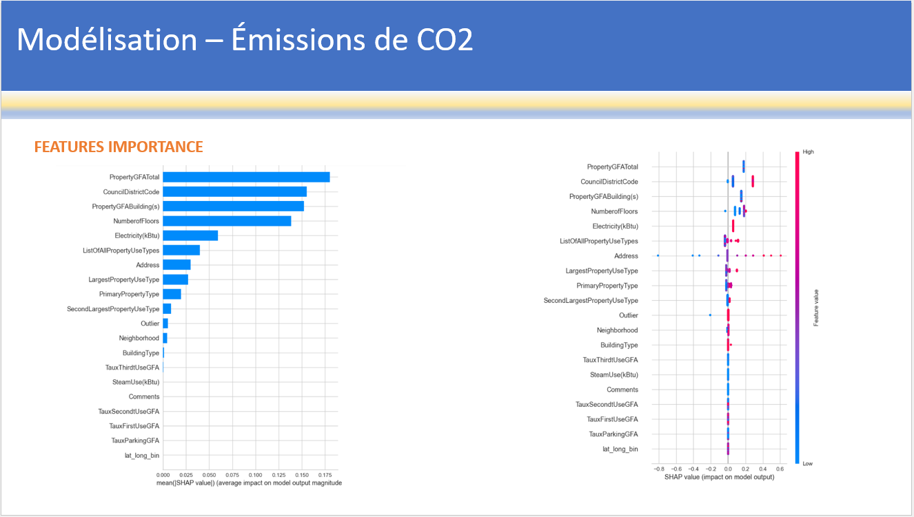

- Les variables les plus importantes pour la prédiction :
  - Localisation des bâtiments.
  - Type d'énergie utilisée.
  - Surface totale.

### Prédictions
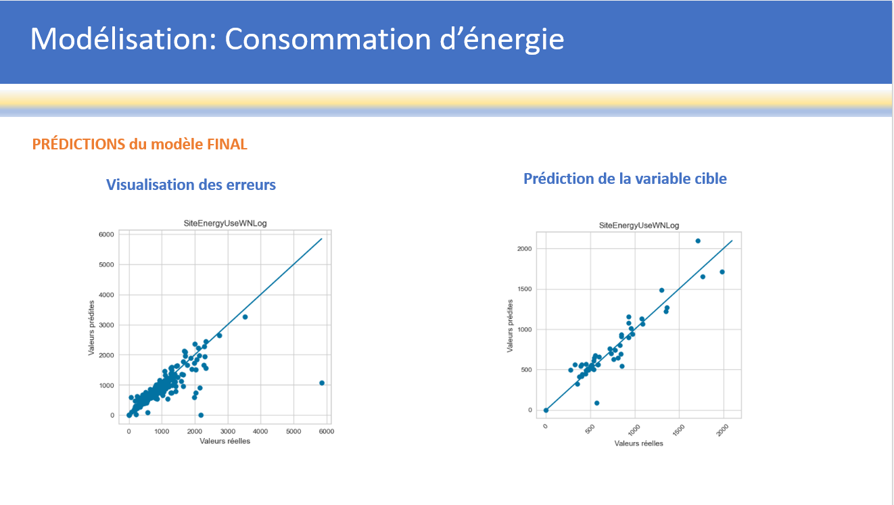
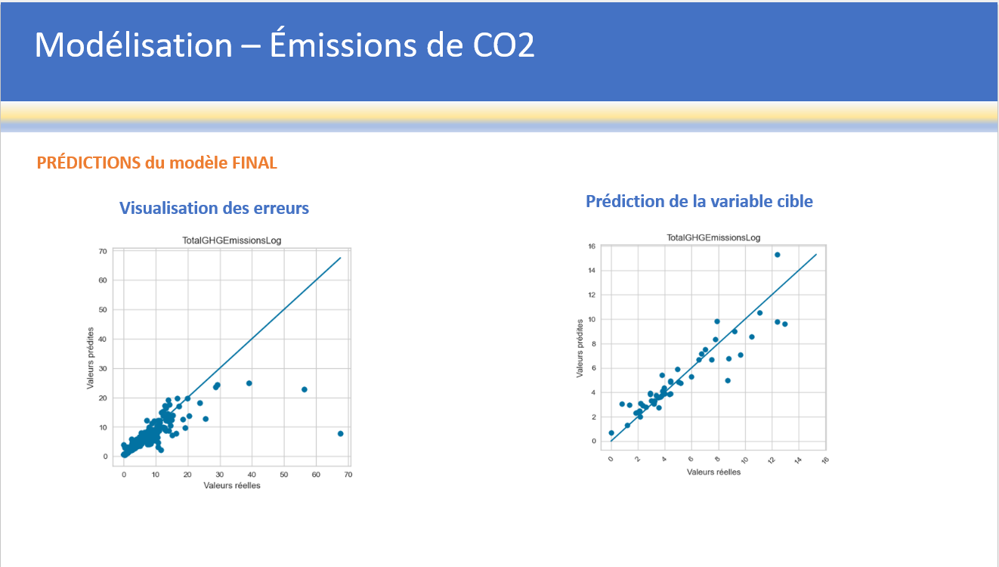

---

## 🚀 Perspectives

### Améliorations possibles
1. **Enrichissement des données** :
   - Collecte de données supplémentaires via des sources publiques ou des API.
   - Ajout de variables liées aux énergies renouvelables.
2. **Optimisation des modèles** :
   - Exploration de réseaux de neurones pour la prédiction.
   - Réduction du nombre de composantes via des techniques de réduction de dimensions (PCA).

---

## 🛠️ Technologies utilisées

- **Langages** : Python (Pandas, NumPy, Scikit-learn, PyCaret).
- **Outils de visualisation** : Matplotlib, Seaborn.
- **Machine Learning** : XGBoost, Gradient Boosting, Random Forest.
- **Pipeline de données** : Nettoyage, Feature Engineering, Modélisation.

